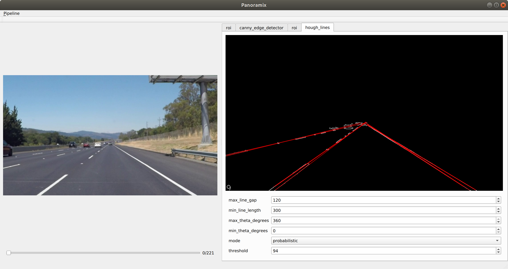

# Panoramix QtWidget - Test playground for your image processors.

Gui application for testing computer vision image processors. 



## Installing external dependencies

### Dependencies managed by conan
- [Catch2](https://github.com/catchorg/Catch2)
- [Trompeloeil](https://github.com/rollbear/trompeloeil)
- [OpenCV](https://github.com/opencv/opencv)
- [JSON for Modern C++](https://github.com/nlohmann/json) 
- [Easylogging++](https://github.com/amrayn/easyloggingpp)

Run the following script for installing the dependencies:

```bash
sh conan_install.sh
```

### Dependencies as git submodules
- [Panoramix](https://github.com/icaroalvarez/panoramix)
- [Image Processors](https://github.com/icaroalvarez/image-processors)

Run the following command for downloading submodules:

```bash
git submodules update --init
```

### Other dependencies
- [Qt Framework](https://www.qt.io/)


## Building the project

### Using CMake

To compile any target in the project, you can directly use CMake. Create a build directory manually and generate the 
Makefiles in it. 

```bash
mkdir build && cd build
cmake ..
make
```

## Running the app
A pipeline configuration is needed in order to run the application. Please see the [example included](doc/configuration.json).
```bash
gui configuration.json
```